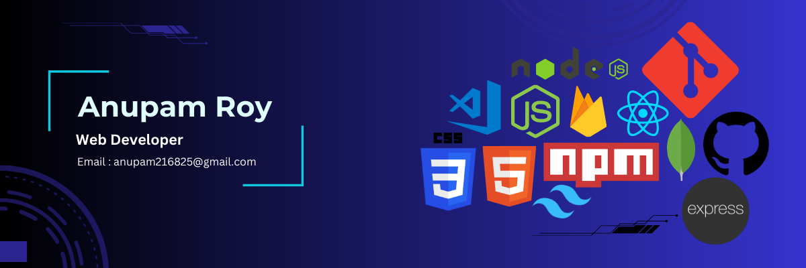

<h1 align="center">Hi there, I'm Anupam Roy 👋</h1>

    Welcome to my GitHub profile! I'm a passionate web developer with a love for creating dynamic and responsive websites. I enjoy working with both front-end and back-end technologies to build full-stack applications.

## 🚀 About Me
- 💼 I’m currently working at **[Your Company/Organization]**
- 🌱 I’m currently learning **[New Technologies or Courses]**
- 👯 I’m looking to collaborate on **[Projects or Open Source Contributions]**
- 💬 Ask me about **[Topics you're knowledgeable about]**
- 📫 How to reach me: **[Your Email]**
- ⚡ Fun fact: **[A fun fact about yourself]**

## 🛠️ Technologies & Tools
### Languages

    
    
    

### Frameworks & Libraries

    
    
    

### Databases

    
    

### Tools

    
    
    

## 📈 GitHub Stats

    

    

## 📊 Most Used Languages

    

## 📫 Connect with Me

    
    
    

    Thank you for visiting my profile! Have a great day! 😄

